
<h1 align="center">助农管理系统</h1>

## 简介
助农管理系统：角色分为管理员、用户；功能包括农产品信息管理、订单处理、用户管理、数据统计、农产品销售记录、管理模块导航和用户信息管理。适用于提高农产品销售效率和资源优化。    --计算机毕业设计源码；毕设源码；java毕业设计源码

## 联系方式

<h3 align="center">获取完整代码与数据库文件 + 微信：deepguan QQ: 86050149 QQ群: 783742310</h3>

<h3 align="center">可帮忙远程部署 包运行成功！提供远程部署、修改代码、设计文档指导、代码讲解等服务！</h3>

## 功能介绍（完整见运行截图）
管理员： 基本功能包括登录、注册和退出等操作。系统提供导航菜单如主页、个人中心、助农新闻、农产品管理等模块，方便在各功能间切换。管理员可以管理用户信息，编辑或删除农产品信息，并查看和上传图片，与此同时具有处理订单、管理留言和处理新闻发布的权限。管理员可以查看统计数据，通过图表分析销售情况，以优化资源配置和运营策略。

用户： 用户可以通过登录和注册功能访问系统。首页提供导航选项，如个人中心、农产品信息管理、订单管理和新闻中心等。通过用户管理模块，用户可以查看和编辑个人信息、管理地址和查询订单。在农产品管理模块中，用户可以检索农产品详情，使用搜索功能查找所需产品。出售统计图表为用户提供清晰的市场趋势预览，帮助做出购买和运营决策。

工作人员： 负责具体农产品的管理工作，记录和更新农产品的销售信息。可以填写销售数据信息，如名字、编号、类型、数量、销售时间和金额等，还有权限查看、编辑和删除农产品库存和销售数据。借助数据检索和筛选功能，工作人员可以高效地维护和查询数据记录。此外，系统提供基本的数据分析工具，以支持工作人员在可能的市场变化中调整销售策略。

农产品经理： 主要负责对接和管理农产品经济数据。通过农产品经济数据类型管理界面，录入和更新农产品的采购价和销售价。经理可以使用系统提供的过滤和搜索功能，快速准确地定位所需数据，并更新和调整定价策略，以根据市场需求作出灵活响应。经理还会利用销售和市场数据，分析市场趋势以提升产品竞争力并增加农民收益。

## 运行截图
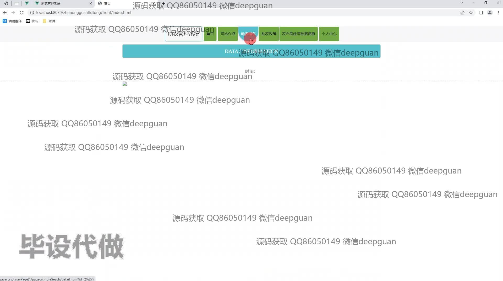
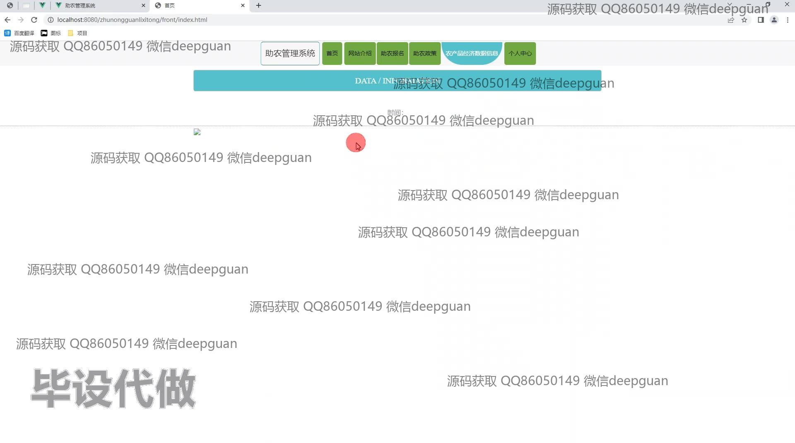
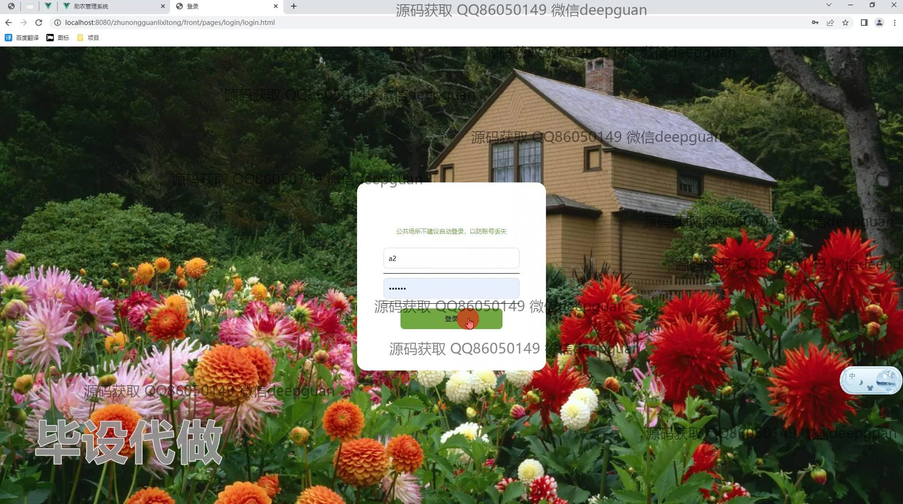
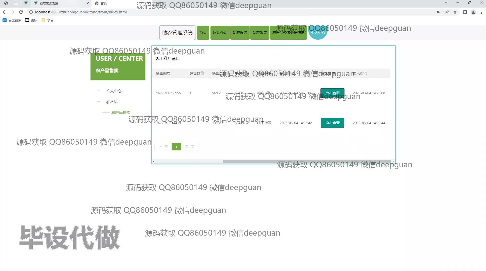
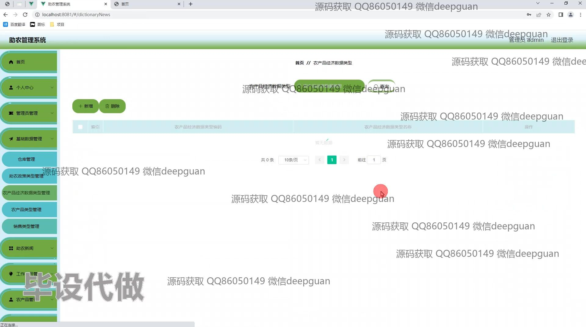
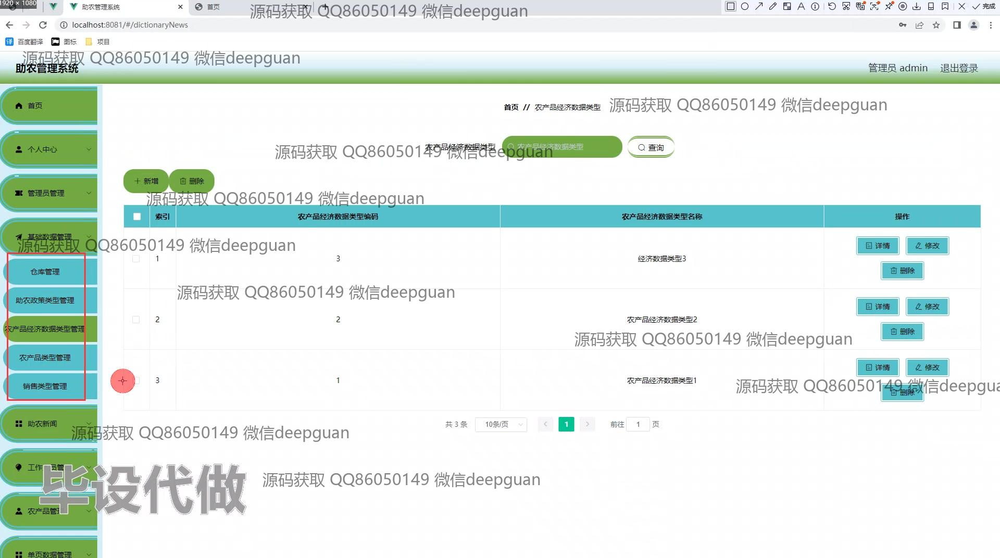
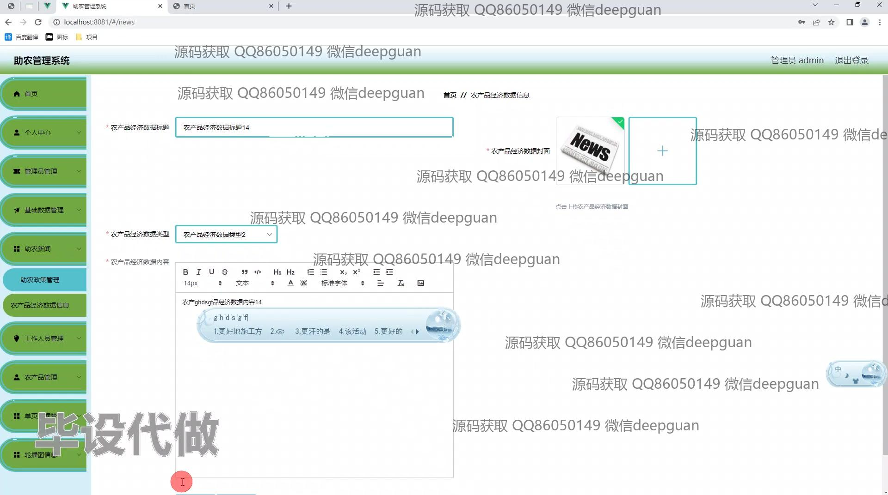
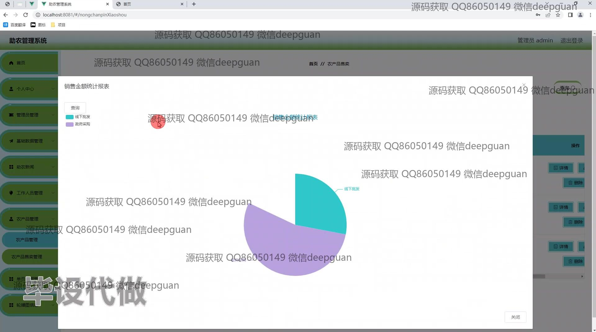
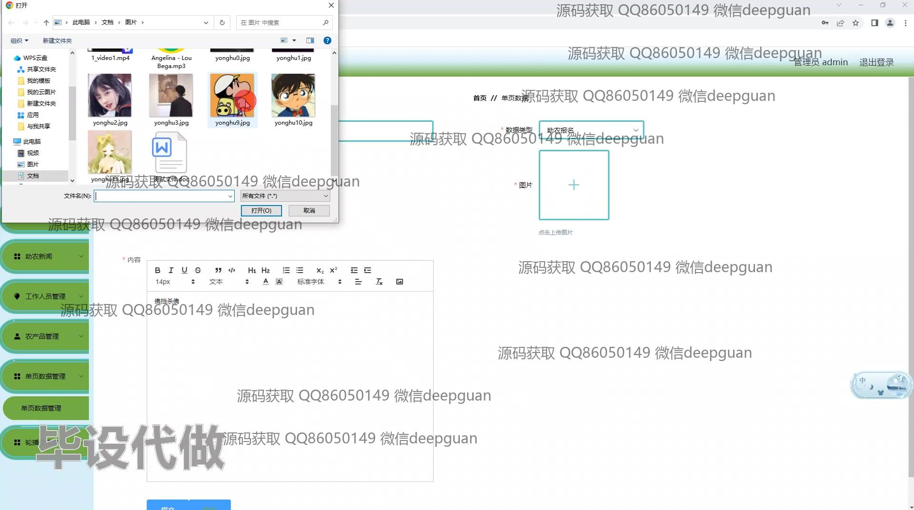
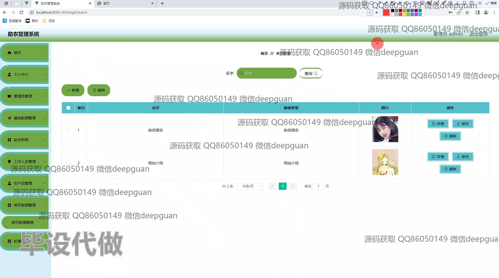
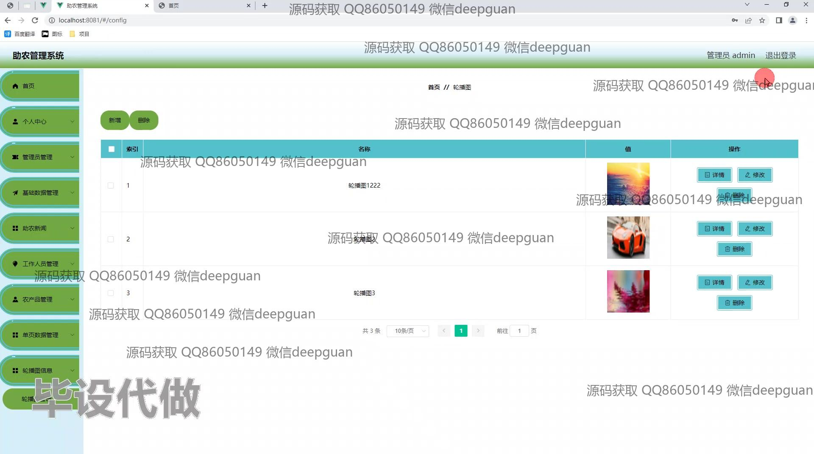
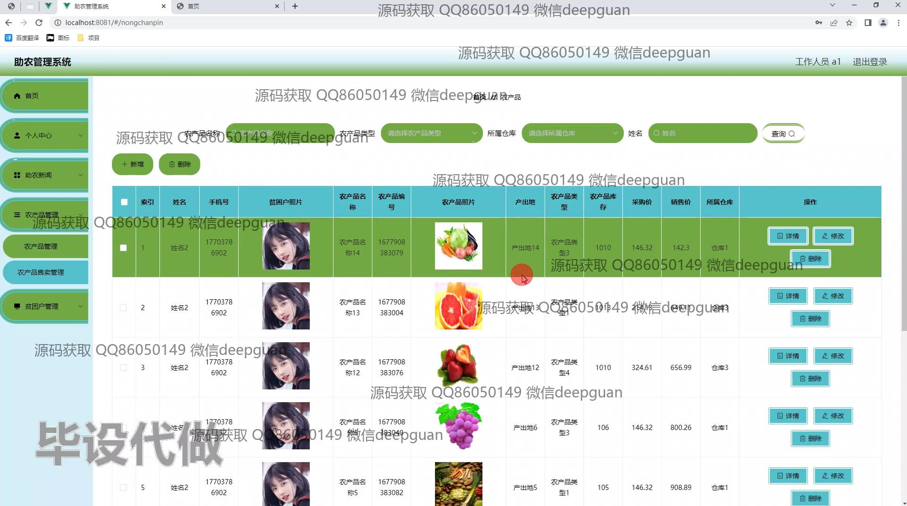
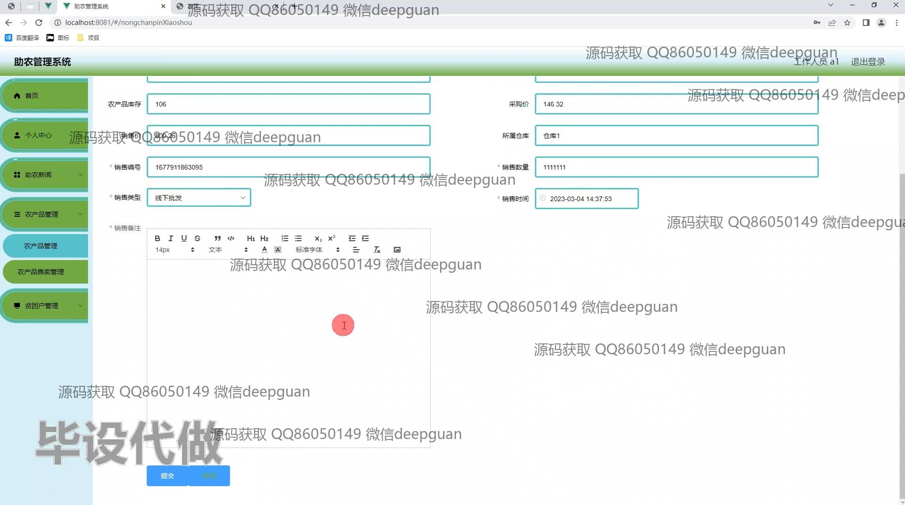
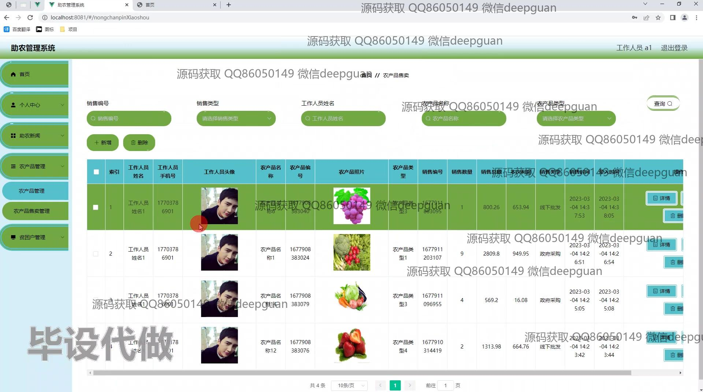
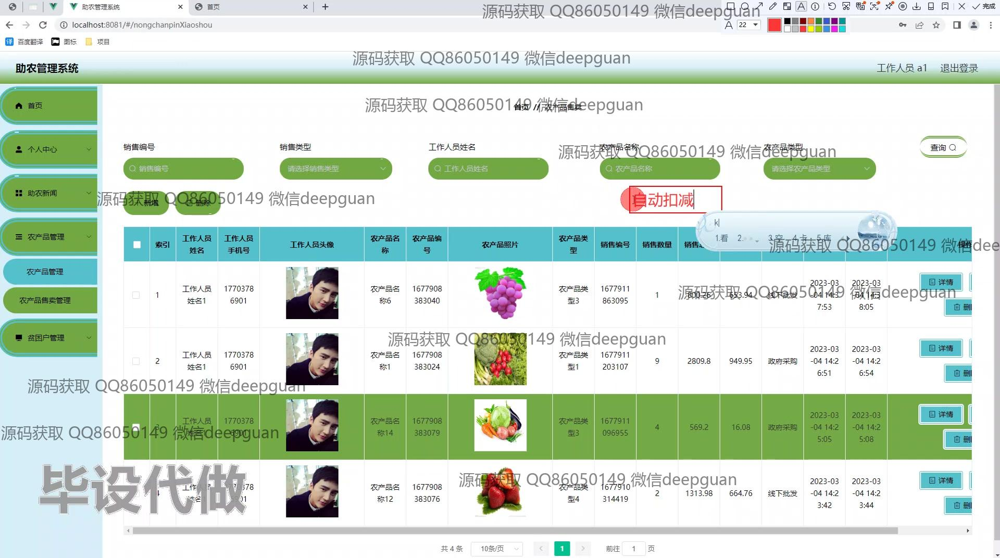
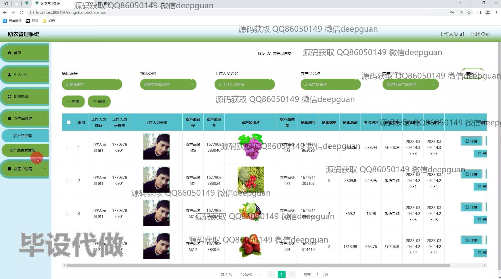
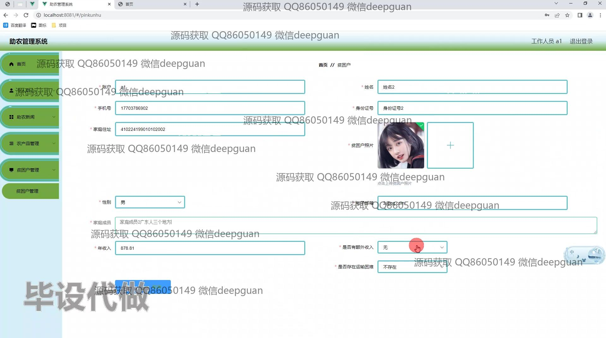

本代码来源于网络,仅供学习参考使用!

